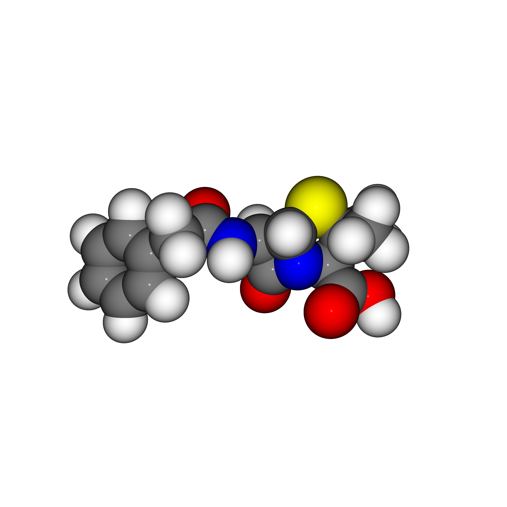

[

---

### Description
Small console app for creating simple space-filling depictions of molecules.

This app is an extension of the raytracer in the Fable REPL: https://fable.io/repl/

### Usage
Directly call the command line interface project with path to SDF file as only argument, like:
```bash
dotnet run -p ./src/Cli/Cli.fsproj <path_to_sdf_file>
```

### Example
```bash
dotnet run -p ./src/Cli/ ~/penicillin.sdf
```

